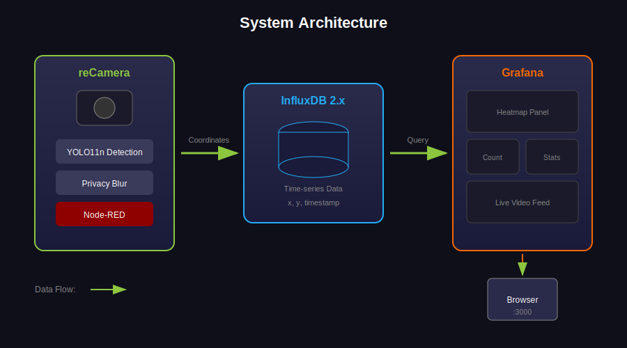

## Preset: Quick Preview {#simple}

Just one reCamera - view heatmap directly in its web interface.

| Device | Purpose |
|--------|---------|
| reCamera | AI camera that detects people in the video |

**What you'll get:**
- Live video with heatmap overlay (heatmap generated in real-time by the web interface)
- See busy vs quiet areas in real-time
- Privacy protection (faces auto-blurred)

**Requirements:** New devices need remote access enabled first — connect via USB, wait for boot (~2 min), visit [192.168.42.1/#/setting](http://192.168.42.1/#/setting), login with `recamera` / `recamera`, enable "Remote Access"

## Step 1: Enable People Detection {#deploy_detector type=recamera_cpp required=true config=devices/recamera_yolo11.yaml}

Install the person detection program on reCamera so it can identify people in the video.

### Target: YOLO11 (~8 FPS) {#deploy_detector_yolo11 config=devices/recamera_yolo11.yaml default=true}

### Wiring

1. USB connection: IP address `192.168.42.1`, plug and play
2. Network/WiFi: Find reCamera's IP in your router admin page
3. Enter username `recamera`, password `recamera`

Recommended for most scenarios.

### Troubleshooting

| Issue | Solution |
|-------|----------|
| Cannot connect | USB: use `192.168.42.1`; Network: check router for IP |
| Wrong password | Default is `recamera`, use your new password if changed |
| Install failed | Restart the camera and try again |

### Target: YOLOv26 (~3 FPS) {#deploy_detector_yolo26 config=devices/recamera_yolo26.yaml}

### Wiring

1. USB connection: IP address `192.168.42.1`, plug and play
2. Network/WiFi: Find reCamera's IP in your router admin page
3. Enter username `recamera`, password `recamera`

Alternative model, try if needed.

### Troubleshooting

| Issue | Solution |
|-------|----------|
| Cannot connect | USB: use `192.168.42.1`; Network: check router for IP |
| Wrong password | Default is `recamera`, use your new password if changed |
| Install failed | Restart the camera and try again |

---

## Step 2: View Live Heatmap {#preview type=preview required=false config=devices/preview.yaml}

Click **Connect** to see the live video with heatmap overlay.

**Tip:** The heatmap builds up over time - wait a few minutes to see the effect.

---

## Preset: Data Dashboard {#grafana}

Add a computer to run the dashboard - save history and view traffic trends over time.

| Device | Purpose |
|--------|---------|
| reCamera | AI camera that detects people and sends location data |
| Computer or reComputer R1100 | Runs Grafana dashboard + InfluxDB |

**What you'll get:**
- View daily/weekly traffic trends with charts
- Customize dashboard layout
- Export data for analysis

**Requirements:** Docker installed · Same network for all devices

## Step 1: Start Data Dashboard {#backend type=docker_deploy required=true config=devices/backend.yaml}

Start the data storage and chart display services on your computer (or a dedicated server).

### Target: Run on This Computer {#backend_local type=local config=devices/backend.yaml default=true}

### Wiring

Make sure Docker Desktop is installed and running, with at least 2GB free disk space.

### Troubleshooting

| Issue | Solution |
|-------|----------|
| Port conflict error | Close the program using port 8086 or 3000 |
| Docker not starting | Open Docker Desktop application |
| Stops after starting | Make sure you have at least 4GB RAM |

### Target: Run on Another Device {#backend_remote type=remote config=devices/backend_remote.yaml}

### Wiring

| Field | Example |
|-------|---------|
| Device IP | 192.168.1.100 or reComputer-R110x.local |
| Username | recomputer |
| Password | 12345678 |

### Troubleshooting

| Issue | Solution |
|-------|----------|
| Connection timeout | Check network cable, test with ping |
| SSH authentication failed | Verify username and password |

---

## Step 2: Connect Camera to Dashboard {#recamera type=recamera_nodered required=true config=devices/recamera.yaml}

Tell reCamera where to send the traffic data.

### Wiring

1. USB connection: IP address `192.168.42.1`, plug and play
2. Network/WiFi: Find reCamera's IP in your router admin page
3. Enter reCamera IP and Dashboard Server IP (from Step 1)

### Troubleshooting

| Issue | Solution |
|-------|----------|
| Cannot connect | USB: use `192.168.42.1`; Network: check router for IP |
| No data showing | Make sure Step 1 completed; camera and server on same network |

---

## Step 3: Show Heatmap on Floor Plan (Optional) {#heatmap type=manual required=false}

Overlay the heatmap on your store's floor plan image.

### How to Do It

1. **Prepare Images**
   - Take a screenshot from reCamera
   - Get your store's floor plan image

2. **Run the Calibration Tool**
   - Run: `python calibration_tool.py`
   - Click 4 reference points on the camera image
   - Click the same 4 spots on your floor plan

3. **View the Result**
   - Run `python -m http.server 8080`
   - Open `http://localhost:8080` in browser

### Skip This If

You only want to see the camera-view heatmap in the dashboard.

---

# Deployment Complete

## All Done!

Your real-time heatmap system is now running.

### Access Points

| Service | URL |
|---------|-----|
| Data Dashboard | http://\<server-ip\>:3000 |

### Login

- Username: `admin`
- Password: `admin`

Dashboard is pre-configured. Just open it to see your data.

### Having Issues?

- **No data showing**: Check that reCamera is connected
- **Can't open dashboard**: Run `docker ps` to check if services are running
