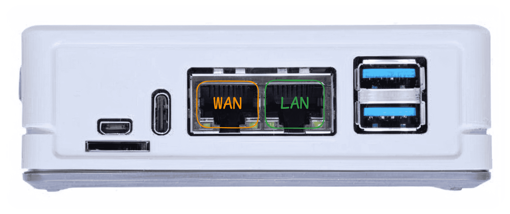
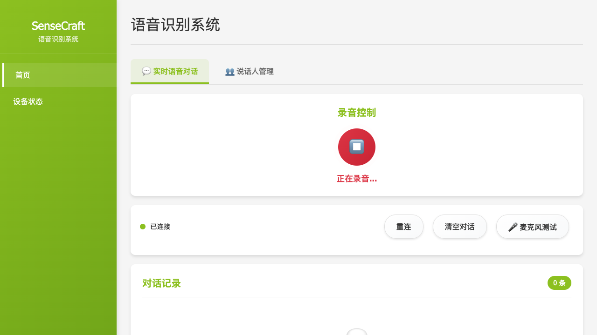

## Preset: Standard Deployment {#default}

Deploy an edge-based voice collection and analysis system for your retail store.

| Device | Purpose |
|--------|---------|
| reRouter CM4 | Edge computing device, runs voice services |
| reSpeaker XVF3800 | 4-mic array for capturing store conversations |

**What you'll get:**
- Real-time voice transcription from store conversations
- Speaker recognition - identify who is speaking
- [SenseCraft Voice](https://voice.sensecraft.seeed.cc/) cloud platform for multi-store analytics
- Privacy-first design - audio processing happens on-device

**Requirements:** USB-C data cable · Network cables

## Step 1: Flash OpenWrt Firmware {#firmware type=manual required=true config=devices/firmware.yaml}

Write the operating system to the reRouter, then connect it to your network.

| Device | Connection | Notes |
|--------|------------|-------|
| reRouter CM4 | Remove SD card or eMMC module | For flashing firmware |
| SD card/eMMC | Insert into card reader, connect to computer | USB 3.0 card reader recommended |

**Flashing Steps:**

1. Download firmware: [Global](https://files.seeedstudio.com/wiki/solution/ai-sound/reRouter-firmware-backup/OpenWRT-24.10.3-RPi-4-Factory.img.gz) | [China](https://files.seeedstudio.com/wiki/solution/ai-sound/reRouter-firmware-backup/OpenWRT-24.10.3-RPi-4-Factory-Chinese.img.gz)
2. Download [Raspberry Pi Imager](https://www.raspberrypi.com/software/) flashing tool
3. Select "Use custom" and choose the downloaded firmware file
4. Select target storage device (SD card or eMMC)
5. Click "Write" and wait for completion
6. Put storage device back into reRouter, connect cables and power on

**First Connection:**

1. Connect computer to reRouter's **LAN port** with network cable
2. Connect **WAN port** to your router with another network cable
3. Wait 1-2 minutes for boot
4. Visit `http://192.168.49.1` in browser
5. Login: username `root`, password empty

### Troubleshooting

| Issue | Solution |
|-------|----------|
| Cannot access 192.168.49.1 | Make sure the cable is plugged into the LAN port, not the WAN port |
| Page loads slowly | Wait 2 minutes for the system to fully boot |
| Flashing failed | Format the storage device and try again |
| Login failed | Password is empty, just click login |

---

## Step 2: Configure reSpeaker {#respeaker type=manual required=true config=devices/respeaker.yaml}

Connect the microphone to your computer and adjust audio settings for best voice quality.

| Device | Connection | Notes |
|--------|------------|-------|
| reSpeaker XVF3800 | USB-C to **computer** | Must connect to computer for configuration, not reRouter |
| Computer | Terminal/command line required | Windows: PowerShell, Mac/Linux: Terminal |

**Why Configuration is Needed:**

reSpeaker has echo cancellation enabled by default, which affects recording quality for this solution. We need to disable it.

**Configuration Steps:**

1. Connect reSpeaker to **computer** via USB-C (not reRouter)
2. Verify computer recognizes the device (Windows Device Manager / Mac System Info)
3. Download configuration tool:
   ```bash
   git clone https://github.com/respeaker/reSpeaker_XVF3800_USB_4MIC_ARRAY.git
   cd reSpeaker_XVF3800_USB_4MIC_ARRAY
   ```
4. Navigate to your OS directory (`windows` / `macos` / `linux`)
5. Run configuration commands:
   ```bash
   # Mac/Linux requires sudo
   sudo ./xvf_host clear_configuration 1
   sudo ./xvf_host audio_mgr_op_r 8 0
   sudo ./xvf_host save_configuration 1
   ```
6. After configuration, **disconnect from computer** and connect reSpeaker to **reRouter USB port**

### Troubleshooting

| Issue | Solution |
|-------|----------|
| Device not recognized | Try a different USB cable, make sure it's a data cable not just a charging cable |
| Command error | Make sure you're in the correct OS directory |
| Permission denied | Mac/Linux requires sudo, Windows needs to run as administrator |
| No effect after configuration | Unplug and replug reSpeaker to apply the configuration |

---

## Step 3: Deploy Voice Services {#voice_services type=docker_deploy required=true config=devices/rerouter.yaml}

Start the voice recognition and analysis services on the device.

### Target: Local Deployment {#voice_services_local type=local config=devices/voice_local.yaml}

Deploy voice services on your local computer.

### Wiring

| Device | Connection | Notes |
|--------|------------|-------|
| reSpeaker XVF3800 | USB to computer | Must complete Step 2 configuration first |
| Computer | Docker Desktop installed | Download for Windows/Mac |

1. Make sure Docker Desktop is installed and running
2. Confirm reSpeaker XVF3800 is connected via USB
3. Verify at least 2GB free disk space and port 8090 is available
4. Check reSpeaker is recognized: **Windows** Device Manager > Sound controllers; **Mac** System Preferences > Sound > Input; **Linux** run `arecord -l`

### Troubleshooting

| Issue | Solution |
|-------|----------|
| Docker not running | Start the Docker Desktop application |
| Port 8090 is occupied | Close the program using that port, or modify the configuration to use a different port |
| Microphone device not found | Unplug and replug USB, verify it appears in Device Manager |
| Container startup failed | Check Docker logs: `docker logs sensecraft-voice-client` |

### Target: Remote Deployment {#voice_services_remote type=remote config=devices/rerouter.yaml default=true}

Deploy voice services to a remote device (reRouter, Raspberry Pi, etc.).

### Wiring



| Device | Connection | Notes |
|--------|------------|-------|
| reSpeaker XVF3800 | USB to reRouter | Must complete Step 2 configuration first |
| reRouter CM4 | WAN port to router | Internet required for downloading container images |
| reRouter CM4 | LAN port to computer | For SSH access and deployment |
| Computer | Same network as reRouter | For running remote deployment |

1. Confirm reRouter WAN port is connected to router and has internet
2. Connect computer to reRouter LAN port
3. Default SSH: IP `192.168.49.1`, user `root`, no password
4. Plug reSpeaker XVF3800 into reRouter USB port

### Troubleshooting

| Issue | Solution |
|-------|----------|
| SSH connection refused | Make sure the cable is plugged into the LAN port and the IP is correct |
| Authentication failed | OpenWrt default password is empty, just press Enter |
| Image download timeout | Check the WAN port network connection, make sure you can access the internet |
| Container startup failed | SSH in and run `docker logs sensecraft-voice-client` to view error messages |
| Microphone not found | Run `arecord -l` to verify reSpeaker is recognized |
| "Health check failed" warning in logs | Normal during startup - the voice client starts before the ASR server is ready. Wait 30 seconds and check again |

---

# Deployment Complete

Voice AI system is ready!

## Service Access

After deployment, you can access the following services:

| Service | URL | Purpose |
|---------|-----|---------|
| Edge Client | http://\<device-ip\>:8090 | Real-time transcription, speaker management, device settings |
| OpenWrt Admin | http://\<device-ip\> | Network configuration, system management |
| SenseCraft Voice | https://voice.sensecraft.seeed.cc/ | Cloud platform - multi-store analytics, AI analysis, data export |

## Initial Setup

1. **Reboot the device** — run `reboot` command via SSH, then wait 2 minutes
2. **Open Edge Client** — visit `http://<device-ip>:8090` in your browser
3. **Test voice recognition** — speak near the reSpeaker and watch real-time transcription appear

## Edge Client (http://\<device-ip\>:8090)

The edge client provides local voice processing and device management:



| Feature | Description |
|---------|-------------|
| Real-time ASR | Live speech-to-text transcription - verify audio input and recognition accuracy |
| Speaker Recognition | Register voiceprints to automatically identify who is speaking |
| Device Configuration | Change network settings (WiFi) and upstream server address for cloud sync |

## Cloud Platform (https://voice.sensecraft.seeed.cc/)

Connect your edge device to the SenseCraft Voice cloud platform for advanced analytics:

| Module | Description |
|--------|-------------|
| **Dashboard** | Overview with store filtering, daily collection trends, and keyword hotspot analysis |
| **Record Management** | Search, filter, and export voice records. Switch between conversation view and timeline view with audio playback |
| **AI Analysis** | Submit voice records to AI for custom processing based on your prompts |
| **Store Management** | Organize devices by store, location, and device name |
| **Backend Settings** | Configure keywords & synonyms for event detection, AI prompts, and user permissions |

**To connect to the cloud platform:**
1. Open Edge Client > Device Status page
2. The upstream server address is pre-configured
3. Your device will automatically register and appear in the cloud platform

## Quick Verification

- Speak near the reSpeaker microphone
- Check edge client for real-time transcription
- Verify text appears on the web dashboard
- Check speaker recognition identifies different speakers

## Next Steps

- [View Wiki Documentation](https://wiki.seeedstudio.com/cn/solutions/smart-retail-voice-ai-solution-1/)
- [SenseCraft Voice Platform](https://voice.sensecraft.seeed.cc/)
- [Purchase Hardware](https://www.seeedstudio.com.cn/solutions/voicecollectionanalysis-zh-hans)
