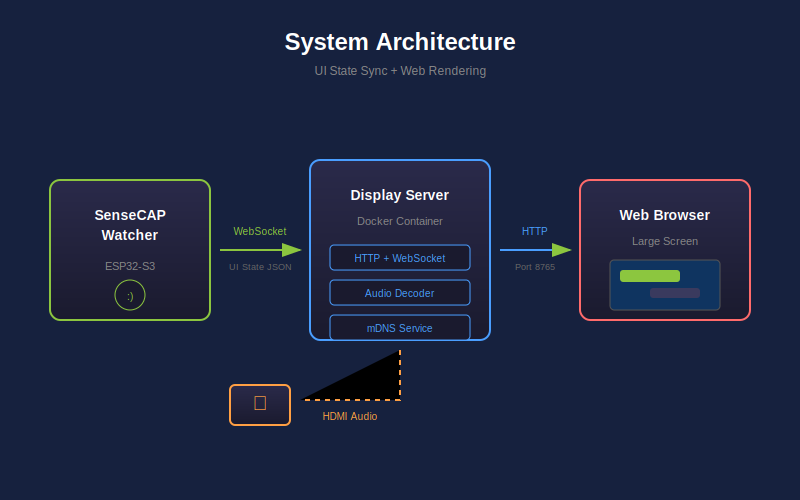

## Preset: Face Recognition {#face_recognition}

Add face recognition to your Xiaozhi, letting it recognize family and friends.

| Device | Purpose |
|--------|---------|
| SenseCAP Watcher | AI voice assistant with camera |
| USB-C data cable | For firmware flashing |

**What you'll get:**
- Automatic greeting when recognized face appears
- Voice-based face enrollment ("Remember my face, I'm John")
- Stores up to 20 people

**Requirements:** WiFi network · [Xiaozhi App](https://github.com/78/xiaozhi-esp32) for device binding

## Step 1: Flash Xiaozhi Firmware {#face_esp32 type=esp32_usb required=true config=devices/watcher_esp32.yaml}

Write the voice assistant program to the Watcher to enable voice interaction.

### Wiring

1. Connect Watcher to computer via USB-C cable
2. Select the serial port above (choose one starting with wchusbserial)
3. Click the Flash button

### Troubleshooting

| Problem | Solution |
|---------|----------|
| Serial port not found | Try a different USB cable or USB port |
| No serial data received | Hold BOOT button, press RESET, release BOOT, then retry |
| Flash failed | Unplug and reconnect the device |

---

## Step 2: Flash Face Recognition Firmware {#face_himax type=himax_usb required=true config=devices/watcher_himax.yaml}

Write the face recognition program to the Watcher's AI chip.

### Wiring

1. Ensure Watcher is connected to computer
2. Select the serial port above (choose one starting with usbmodem)
3. Click the Flash button
4. After clicking Flash, press the reset button on the device to enter flash mode

### Troubleshooting

| Problem | Solution |
|---------|----------|
| Device not responding | Unplug and reconnect the USB cable |
| Flash stuck or fails | Press the reset button and try again |
| Flash fails repeatedly | Use a different USB cable or port |
| Flash fails at 99% or restarts mid-flash | Close other apps using serial ports, reconnect USB and retry |

---

## Step 3: Configure Xiaozhi {#face_configure type=manual required=false}

Connect the Watcher to WiFi and bind it to your account using the mobile app.

### Connect to WiFi

Device will prompt for network setup on first boot. Follow voice instructions to connect to WiFi.

### Bind Xiaozhi Account

1. Open Xiaozhi App
2. Scan the QR code displayed on device
3. Complete the binding process

### Test the Function

Wake up the device by saying "Xiaozhi Xiaozhi", then say "Remember my face, my name is Mike" to test face enrollment.

### Troubleshooting

| Problem | Solution |
|---------|----------|
| WiFi connection failed | Ensure using 2.4GHz network, check password |
| QR code not showing | Restart device, wait for boot complete |

---

## Step 4: Face Database Management {#face_enroll type=serial_camera config=devices/face_enroll.yaml required=false}

Manage the face recognition database through the app interface.

### How to Use

1. Click **Connect** to start the camera preview
2. You'll see a live feed with face detection boxes
3. Use the **Face Database** panel below to manage enrolled faces

### Register a New Face

1. Click **Register** in the Face Database panel
2. Enter a name for the person
3. Click **Start Capture** — face the camera with good lighting
4. Wait for the capture to complete (5 seconds)
5. The new face will appear in the table

### Troubleshooting

| Problem | Solution |
|---------|----------|
| "Please complete Step X first" | Go back and select the correct serial port in the indicated step |
| Camera not showing | Check USB connection, try refreshing ports in Step 2 |
| Enrollment failed | Ensure good lighting, face the camera directly, try again |

### Deployment Complete

Face recognition database is ready!

**Manage faces** directly from this panel — register, rename, or delete entries at any time.

---

## Preset: Display Cast {#display_cast}

Cast Xiaozhi conversations to TV or large display, ideal for exhibition halls, meeting rooms and multi-person scenarios.

| Device | Purpose |
|--------|---------|
| SenseCAP Watcher | AI voice assistant |
| reComputer R1100 | Edge computing device, runs display service |
| HDMI Display | Shows cast content |

**What you'll get:**
- Real-time conversation display on big screen
- Fullscreen mode for presentations
- mDNS auto-discovery - connect by voice command

**Requirements:** All devices on same network

## Step 1: Flash Watcher Firmware {#display_watcher type=esp32_usb required=true config=devices/display_watcher.yaml}

Write the voice assistant program to the Watcher for display casting.

### Wiring

1. Connect Watcher to your computer using USB-C cable
2. Select the serial port above
3. If not detected, try a different USB port or cable

### Troubleshooting

| Problem | Solution |
|---------|----------|
| Serial port not found | Try a different USB cable or USB port |
| Flash failed | Unplug and reconnect the device |

---

## Step 2: Deploy Display Service {#display_service type=docker_deploy required=true config=devices/display_local.yaml}

Start the display service that shows conversations on your screen.

### Target: Local Deployment {#display_service_local type=local config=devices/display_local.yaml}

Deploy the display service on your local computer.

### Wiring

1. Ensure Docker is installed and running
2. Set a display name (e.g. "Living Room Display") for mDNS discovery
3. Click Deploy button to start services

### Troubleshooting

| Problem | Solution |
|---------|----------|
| Docker not found | Install Docker Desktop |
| Port 8765 busy | Stop other services using this port |

### Target: Remote Deployment {#display_service_remote type=remote config=devices/recomputer.yaml default=true}

Deploy the display service to reComputer R1100.

### Wiring

1. Connect reComputer to network and HDMI display
2. Enter IP address and SSH credentials
3. Set a display name (e.g. "Meeting Room Display") for mDNS discovery
4. Click Deploy to install on remote device

### Troubleshooting

| Problem | Solution |
|---------|----------|
| SSH connection failed | Check IP address and credentials |
| Docker pull failed | Check network connection, retry deployment |
| Watcher can't find display | Ensure both devices on same network, check firewall |

### Deployment Complete

Display cast is ready!

**Test it:**
1. Open `http://<device-ip>:8765` on display browser
2. Press `F` for fullscreen mode
3. Say "Cast to [Display Name]" to start

**Voice commands:** "Start casting", "Stop casting", "Cast status"
