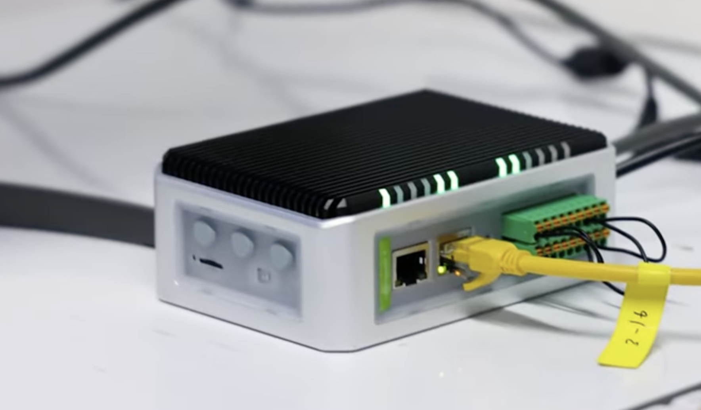
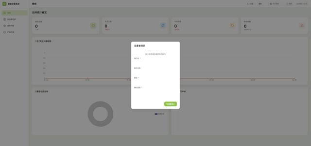
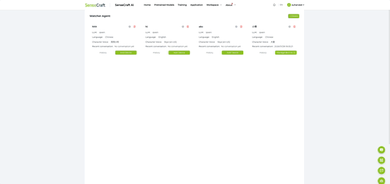

## 套餐: SenseCraft 云方案 {#sensecraft_cloud}

使用 [SenseCraft](https://sensecraft.seeed.cc/ai/) 云服务提供语音 AI 能力。最简单的部署方式——只需部署仓管系统，将 Watcher 连接到 SenseCraft 平台即可。

| 设备 | 用途 |
|------|------|
| SenseCAP Watcher | 语音助手，接收语音指令 |
| reComputer R1100 | 运行仓库管理系统 |

**部署完成后你可以：**
- 语音操控库存（说"入库 10 箱苹果"就能录入）
- 网页实时查看库存数据
- 开箱即用，无需额外配置

**前提条件：** 需要联网 · [SenseCraft 账号](https://sensecraft.seeed.cc/ai/)（免费注册）

## 步骤 1: 仓库管理系统 {#warehouse type=docker_deploy required=true config=devices/recomputer.yaml}

部署库存管理服务，支持语音操控和网页看板。

### 部署目标: 本机部署 {#warehouse_local type=local config=devices/recomputer.yaml}

在本机运行仓库管理服务。

### 接线

1. 确保本机 Docker 已安装并运行
2. 点击部署按钮启动服务

### 故障排除

| 问题 | 解决方法 |
|------|----------|
| 端口被占用 | 检查 2125 端口是否被其他服务使用 |
| Docker 未运行 | 启动 Docker Desktop 后重试 |

### 部署目标: 远程部署 {#warehouse_remote type=remote config=devices/warehouse_remote.yaml default=true}

部署到 reComputer R1100 边缘计算设备。

### 接线

1. 将 R1100 接上电源和网线，确保与电脑在同一网络
2. 输入 IP 地址 `reComputer-R110x.local`（或从路由器查询）
3. 输入用户名 `recomputer`，密码 `12345678`
4. 点击部署，等待安装完成

### 故障排除

| 问题 | 解决方法 |
|------|----------|
| 连接超时 | 检查网线是否插好，用 ping reComputer-R110x.local 测试 |
| SSH 认证失败 | 确认用户名密码正确，首次使用需接显示器完成初始设置 |

---

## 步骤 2: 配置仓库系统 {#warehouse_config type=manual required=true}

部署完成后，打开仓库管理系统完成初始配置：

1. 浏览器访问 `http://服务器IP:2125`（本机部署用 `localhost`）
2. 首次访问会弹出「设置管理员」窗口，填写信息后点击确定
3. 进入系统后，点击左侧「库存列表」导入现有库存（[下载 Excel 模板](assets/inventory_import.xlsx)）

### 故障排除

| 问题 | 解决方法 |
|------|----------|
| 页面打不开 | 等待 30 秒让服务启动完成 |
| 导入失败 | 检查 Excel 格式是否与模板一致 |
| 忘记管理员密码 | 进入「设备管理」删除此应用（勾选「删除数据」），然后重新部署 |

---

## 步骤 3: 配置 Watcher 设备 {#sensecraft type=manual required=true}

将 Watcher 连接到 SenseCraft 云平台：

1. 打开 Watcher 电源，手机连接设备屏幕显示的 WiFi 热点，在弹出页面中配置 WiFi，配置完成后设备会重启并显示 6 位验证码
2. 登录 [SenseCraft AI 平台](https://sensecraft.seeed.cc/ai/)，点击右上角「Watcher Agent」→「Bind Device」，输入设备上显示的 6 位验证码
3. 点击「Create」新建一个 Agent，设置名称和语言后保存
4. 点击 Agent 卡片上的设置图标，进入「MCP Setting」复制端点地址

### 故障排除

| 问题 | 解决方法 |
|------|----------|
| 手机搜不到热点 | 确保手机 WiFi 已开启，靠近 Watcher 设备重试 |
| 配网失败 | Watcher 仅支持 2.4GHz WiFi，检查路由器是否开启 2.4GHz 频段 |
| 找不到 Watcher Agent | 确认已登录 SenseCraft 账号，刷新页面 |

---

## 步骤 4: 联动智能体 {#mcp_bridge type=manual required=true}

这一步让 Watcher 能够操作仓库系统：

1. 打开仓库系统，进入左侧「智能体配置」
2. 点击「添加智能体」，填写名称，在 Endpoint 中粘贴上一步复制的端点地址
3. 点击「保存并启动」
4. 点击智能体卡片上的「MCP 接入点」，刷新状态显示 Connected 即连接成功

### 故障排除

| 问题 | 解决方法 |
|------|----------|
| 连接失败 | 检查端点地址是否完整复制，不要包含多余空格 |
| 状态一直显示 Disconnected | 确认 Watcher 已正确绑定到 SenseCraft 平台 |

---

## 步骤 5: 效果体验 {#demo type=manual required=false}

试试这些语音指令：

| 说这句话 | Watcher 会做什么 |
|----------|------------------|
| "苹果还有多少？" | 查询苹果的库存数量 |
| "入库 10 箱苹果" | 添加 10 箱苹果到库存 |
| "出库 5 箱香蕉" | 从库存减少 5 箱香蕉 |
| "今天入库了什么？" | 列出今日入库记录 |

说完后可以在仓库网页界面查看库存变化。

### 故障排除

| 问题 | 解决方法 |
|------|----------|
| Watcher 没反应 | 确认 联动智能体正在运行 |
| 库存没更新 | 刷新网页查看最新数据 |

### 部署完成

语音仓库管理系统已就绪！

**访问入口：**
- 仓库系统：http://\<服务器IP\>:2125
- SenseCraft 平台：[sensecraft.seeed.cc](https://sensecraft.seeed.cc/ai/)

试着说「入库 10 箱苹果」测试语音库存管理。

---

## 套餐: 私有云方案 {#private_cloud}

自建语音 AI 服务器，调用云端 API（DeepSeek、OpenAI 等）处理语音。数据不经过第三方平台，只有 API 调用。

| 设备 | 用途 |
|------|------|
| SenseCAP Watcher | 语音助手，接收语音指令 |
| reComputer R1100 | 运行仓管系统 + 语音 AI 服务 |

**部署完成后你可以：**
- 完全掌控数据——库存信息留在自己网络内
- 自由选择 AI 模型（DeepSeek、GPT-4、通义千问等）
- 自定义语音助手的提示词和行为

**前提条件：** 需要联网（调用 LLM/TTS API） · 需要 AI 服务商的 API 密钥（推荐 [DeepSeek](https://platform.deepseek.com/)，注册送免费额度）

## 步骤 1: 仓库管理系统 {#warehouse type=docker_deploy required=true config=devices/recomputer.yaml}

部署库存管理服务，支持语音操控和网页看板。

### 部署目标: 本机部署 {#warehouse_local type=local config=devices/recomputer.yaml}

在本机运行仓库管理服务。

### 接线

1. 确保本机 Docker 已安装并运行
2. 点击部署按钮启动服务

### 故障排除

| 问题 | 解决方法 |
|------|----------|
| 端口被占用 | 检查 2125 端口是否被其他服务使用 |
| Docker 未运行 | 启动 Docker Desktop 后重试 |

### 部署目标: 远程部署 {#warehouse_remote type=remote config=devices/warehouse_remote.yaml default=true}

部署到 reComputer R1100 边缘计算设备。

### 接线

1. 将 R1100 接上电源和网线，确保与电脑在同一网络
2. 输入 IP 地址 `reComputer-R110x.local`（或从路由器查询）
3. 输入用户名 `recomputer`，密码 `12345678`
4. 点击部署，等待安装完成

### 故障排除

| 问题 | 解决方法 |
|------|----------|
| 连接超时 | 检查网线是否插好，用 ping reComputer-R110x.local 测试 |
| SSH 认证失败 | 确认用户名密码正确，首次使用需接显示器完成初始设置 |

---

## 步骤 2: 配置仓库系统 {#warehouse_config type=manual required=true}

部署完成后，打开仓库管理系统完成初始配置：

1. 浏览器访问 `http://服务器IP:2125`（本机部署用 `localhost`）
2. 首次访问会弹出「设置管理员」窗口，填写信息后点击确定
3. 进入系统后，点击左侧「库存列表」导入现有库存（[下载 Excel 模板](assets/inventory_import.xlsx)）

### 故障排除

| 问题 | 解决方法 |
|------|----------|
| 页面打不开 | 等待 30 秒让服务启动完成 |
| 导入失败 | 检查 Excel 格式是否与模板一致 |
| 忘记管理员密码 | 进入「设备管理」删除此应用（勾选「删除数据」），然后重新部署 |

---

## 步骤 3: 语音 AI 服务 {#voice_service type=docker_deploy required=true config=devices/xiaozhi_server.yaml}

部署语音 AI 服务，为 Watcher 提供语音交互能力。部署时选择「私有云方案」，需要填写 LLM API 信息。

获取 API 密钥：[DeepSeek](https://platform.deepseek.com/)（推荐，新用户赠送免费额度） · [OpenAI](https://platform.openai.com/) · [月之暗面](https://platform.moonshot.cn/)

TTS 默认使用免费的 Edge TTS，无需额外配置。

### 部署目标: 本机部署 {#voice_local type=local config=devices/xiaozhi_server.yaml}

### 接线

1. 确保 Docker 已安装并运行
2. 点击部署按钮启动服务

### 部署目标: 远程部署（R1100） {#voice_remote type=remote config=devices/xiaozhi_remote.yaml default=true}

### 接线

1. 输入 R1100 的 IP 地址和 SSH 凭据
2. 点击部署，等待安装完成

### 故障排除

| 问题 | 解决方法 |
|------|----------|
| 镜像拉取失败 | 检查网络连接，或配置 Docker 镜像加速 |
| 端口被占用 | 检查 18000、18003、18004 端口是否被其他服务使用 |
| API 调用失败 | 检查 API 密钥是否正确，余额是否充足 |

---

## 步骤 4: 配置 Watcher 设备 {#watcher_config type=manual required=true}

将 Watcher 连接到本地语音服务：

1. 打开 Watcher 电源，手机连接设备屏幕显示的 WiFi 热点
2. 在弹出页面中点击「高级」选项卡
3. 将 OTA 地址修改为：`http://服务器IP:18003`（服务器 IP 为运行语音服务的设备）
4. 配置 WiFi（仅支持 2.4GHz），完成后设备重启并显示 6 位验证码
5. 访问语音服务控制台 `http://服务器IP:18003`，绑定设备验证码

### 故障排除

| 问题 | 解决方法 |
|------|----------|
| 手机搜不到热点 | 确保手机 WiFi 已开启，靠近 Watcher 设备重试 |
| 配网失败 | Watcher 仅支持 2.4GHz WiFi，检查路由器是否开启 2.4GHz 频段 |
| 绑定失败 | 确认 OTA 地址正确，语音服务已启动 |

---

## 步骤 5: 联动智能体 {#agent_config type=manual required=true}

在仓库系统中添加智能体，让 Watcher 能够操作库存：

1. 打开仓库系统，进入左侧「智能体配置」
2. 点击「添加智能体」，填写名称，在 Endpoint 中输入 `ws://服务器IP:18004/mcp`
3. 点击「保存并启动」
4. 点击智能体卡片上的「MCP 接入点」，刷新状态显示 Connected 即连接成功

### 故障排除

| 问题 | 解决方法 |
|------|----------|
| 连接失败 | 检查端点地址是否正确，语音服务是否运行 |
| 状态一直显示 Disconnected | 确认 MCP 端点服务（端口 18004）正在运行 |

---

## 步骤 6: 效果体验 {#demo type=manual required=false}

试试这些语音指令：

| 说这句话 | Watcher 会做什么 |
|----------|------------------|
| "苹果还有多少？" | 查询苹果的库存数量 |
| "入库 10 箱苹果" | 添加 10 箱苹果到库存 |
| "出库 5 箱香蕉" | 从库存减少 5 箱香蕉 |
| "今天入库了什么？" | 列出今日入库记录 |

说完后可以在仓库网页界面查看库存变化。

### 故障排除

| 问题 | 解决方法 |
|------|----------|
| Watcher 没反应 | 确认智能体已连接（状态显示 Connected） |
| 库存没更新 | 刷新网页查看最新数据 |

### 部署完成

私有云仓管系统已就绪！

**访问入口：**
- 仓库系统：http://\<服务器IP\>:2125
- 语音服务控制台：http://\<服务器IP\>:18003

数据留在自己网络内。试着说「苹果还有多少」测试。

---

## 套餐: 边缘计算方案 {#edge_computing}

所有服务本地运行，包括大语言模型和语音合成——完全不需要联网。适合断网环境或对数据合规要求严格的场景。

| 设备 | 用途 |
|------|------|
| SenseCAP Watcher | 语音助手，接收语音指令 |
| reComputer R1100 | 运行仓管系统 + 语音 AI 服务 |
| reComputer J4012 | 运行本地大模型（Qwen3-8B）和语音合成 |

**部署完成后你可以：**
- 100% 离线运行——没有网络也能用
- 数据完全不出厂区/办公区
- 本地大模型响应速度约 16 tok/s

**前提条件：** 需要 reComputer J4012 或同等 Jetson 设备 · 首次部署需要网络下载镜像

## 步骤 1: 仓库管理系统 {#warehouse type=docker_deploy required=true config=devices/recomputer.yaml}

部署库存管理服务，支持语音操控和网页看板。

### 部署目标: 本机部署 {#warehouse_local type=local config=devices/recomputer.yaml}

在本机运行仓库管理服务。

### 接线

1. 确保本机 Docker 已安装并运行
2. 点击部署按钮启动服务

### 故障排除

| 问题 | 解决方法 |
|------|----------|
| 端口被占用 | 检查 2125 端口是否被其他服务使用 |
| Docker 未运行 | 启动 Docker Desktop 后重试 |

### 部署目标: 远程部署 {#warehouse_remote type=remote config=devices/warehouse_remote.yaml default=true}

部署到 reComputer R1100 边缘计算设备。

### 接线

1. 将 R1100 接上电源和网线，确保与电脑在同一网络
2. 输入 IP 地址 `reComputer-R110x.local`（或从路由器查询）
3. 输入用户名 `recomputer`，密码 `12345678`
4. 点击部署，等待安装完成

### 故障排除

| 问题 | 解决方法 |
|------|----------|
| 连接超时 | 检查网线是否插好，用 ping reComputer-R110x.local 测试 |
| SSH 认证失败 | 确认用户名密码正确，首次使用需接显示器完成初始设置 |

---

## 步骤 2: 配置仓库系统 {#warehouse_config type=manual required=true}

部署完成后，打开仓库管理系统完成初始配置：

1. 浏览器访问 `http://服务器IP:2125`（本机部署用 `localhost`）
2. 首次访问会弹出「设置管理员」窗口，填写信息后点击确定
3. 进入系统后，点击左侧「库存列表」导入现有库存（[下载 Excel 模板](assets/inventory_import.xlsx)）

### 故障排除

| 问题 | 解决方法 |
|------|----------|
| 页面打不开 | 等待 30 秒让服务启动完成 |
| 导入失败 | 检查 Excel 格式是否与模板一致 |
| 忘记管理员密码 | 进入「设备管理」删除此应用（勾选「删除数据」），然后重新部署 |

---

## 步骤 3: Jetson 本地 AI {#jetson_ai type=docker_deploy required=true config=devices/llm_jetson.yaml}

在 Jetson 设备上部署本地大模型和语音合成服务。

### 部署目标: 远程部署（Jetson） {#jetson_remote type=remote config=devices/llm_jetson.yaml default=true}

### 接线

1. 将 Jetson（如 reComputer J4012）接上电源和网线
2. 输入 Jetson 的 IP 地址和 SSH 凭据
3. 选择模型（推荐 Qwen3-8B，需约 4.3GB 显存）
4. 选择部署方式（推荐离线包部署）
5. 点击部署，等待镜像导入和服务启动

### 故障排除

| 问题 | 解决方法 |
|------|----------|
| SSH 连接失败 | 确认 Jetson 已开机，检查 IP 地址是否正确 |
| 显存不足 | 选择更小的模型（Qwen3-4B 约 2.5GB，Qwen3-1.7B 约 1.2GB） |
| 部署时间很长 | 离线包较大（约 5GB），耐心等待 |

---

## 步骤 4: 语音 AI 服务 {#voice_service type=docker_deploy required=true config=devices/xiaozhi_remote.yaml}

在 R1100 上部署语音 AI 服务，连接 Jetson 进行推理。部署时选择「边缘计算方案」，并输入 Jetson IP 地址（如已在上一步部署则自动填充）。

### 部署目标: 本机部署 {#voice_local type=local config=devices/xiaozhi_server.yaml}

### 接线

1. 确保 Docker 已安装并运行
2. 点击部署按钮启动服务

### 部署目标: 远程部署（R1100） {#voice_remote type=remote config=devices/xiaozhi_remote.yaml default=true}

### 接线

1. 输入 R1100 的 IP 地址和 SSH 凭据
2. 点击部署，等待安装完成

### 故障排除

| 问题 | 解决方法 |
|------|----------|
| 无法连接 Jetson | 检查 R1100 和 Jetson 是否在同一网络 |
| 响应很慢 | 确认 Jetson 服务已启动，访问 `http://Jetson-IP:8000/health` 检查 |

---

## 步骤 5: 配置 Watcher 设备 {#watcher_config type=manual required=true}

将 Watcher 连接到本地语音服务：

1. 打开 Watcher 电源，手机连接设备屏幕显示的 WiFi 热点
2. 在弹出页面中点击「高级」选项卡
3. 将 OTA 地址修改为：`http://服务器IP:18003`（服务器 IP 为运行语音服务的设备）
4. 配置 WiFi（仅支持 2.4GHz），完成后设备重启并显示 6 位验证码
5. 访问语音服务控制台 `http://服务器IP:18003`，绑定设备验证码

### 故障排除

| 问题 | 解决方法 |
|------|----------|
| 手机搜不到热点 | 确保手机 WiFi 已开启，靠近 Watcher 设备重试 |
| 配网失败 | Watcher 仅支持 2.4GHz WiFi，检查路由器是否开启 2.4GHz 频段 |
| 绑定失败 | 确认 OTA 地址正确，语音服务已启动 |

---

## 步骤 6: 联动智能体 {#agent_config type=manual required=true}

在仓库系统中添加智能体，让 Watcher 能够操作库存：

1. 打开仓库系统，进入左侧「智能体配置」
2. 点击「添加智能体」，填写名称，在 Endpoint 中输入 `ws://服务器IP:18004/mcp`
3. 点击「保存并启动」
4. 点击智能体卡片上的「MCP 接入点」，刷新状态显示 Connected 即连接成功

### 故障排除

| 问题 | 解决方法 |
|------|----------|
| 连接失败 | 检查端点地址是否正确，语音服务是否运行 |
| 状态一直显示 Disconnected | 确认 MCP 端点服务（端口 18004）正在运行 |

---

## 步骤 7: 效果体验 {#demo type=manual required=false}

试试这些语音指令：

| 说这句话 | Watcher 会做什么 |
|----------|------------------|
| "苹果还有多少？" | 查询苹果的库存数量 |
| "入库 10 箱苹果" | 添加 10 箱苹果到库存 |
| "出库 5 箱香蕉" | 从库存减少 5 箱香蕉 |
| "今天入库了什么？" | 列出今日入库记录 |

说完后可以在仓库网页界面查看库存变化。

### 故障排除

| 问题 | 解决方法 |
|------|----------|
| Watcher 没反应 | 确认智能体已连接（状态显示 Connected） |
| 库存没更新 | 刷新网页查看最新数据 |

### 部署完成

全离线仓管系统已就绪！

**访问入口：**
- 仓库系统：http://\<服务器IP\>:2125
- 语音服务控制台：http://\<服务器IP\>:18003
- 大模型健康检查：http://\<Jetson-IP\>:8000/health

部署完成后 100% 离线运行，无需联网。
