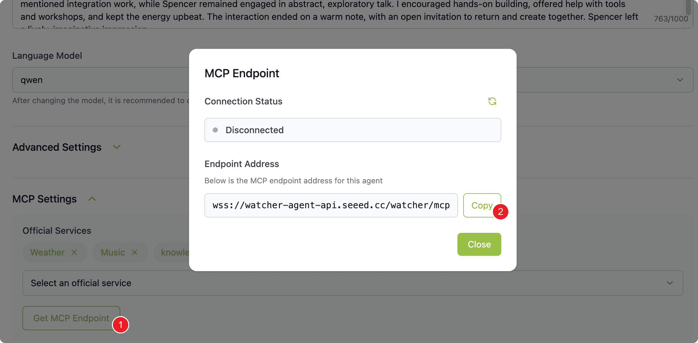

## 套餐: 云方案 {#sensecraft_cloud}

## 步骤 1: 仓库管理系统 {#warehouse type=docker_deploy required=true config=devices/recomputer.yaml}

### 部署目标: 本机部署 {#warehouse_local config=devices/recomputer.yaml}

1. 确保本机 Docker 已安装并运行
2. 点击部署按钮启动服务

### 部署目标: 远程部署 {#warehouse_remote config=devices/warehouse_remote.yaml default=true}

1. 请将你的 R1100/2000 设备通电，并接入网线（跟您的电脑在同一个网络环境内）
2. 输入 IP 地址（默认：reComputer-R110x.local 或通过路由器查询设备 IP 地址）和 SSH 凭据（recomputer：12345678）
3. 点击部署安装到远程设备，等待完成

---

## 步骤 2: 语音 AI 服务 {#voice_service type=docker_deploy required=true config=devices/xiaozhi_server.yaml}

### 部署目标: 本机部署 {#voice_service_local config=devices/xiaozhi_server.yaml}

### 部署目标: 远程部署（R1100） {#voice_service_remote config=devices/xiaozhi_remote.yaml default=true}

---

## 步骤 3: SenseCraft 平台配置 {#sensecraft type=manual required=true}

### 接线

1. 开启 SenseCAP Watcher 电源
2. 扫码连接 Watcher 到 WiFi
3. 登录 SenseCraft AI 平台并绑定设备
4. 从 Watcher Agent 设置获取 MCP 端点

---

## 步骤 4: MCP 桥接服务 {#mcp_bridge type=script required=true config=devices/mcp_bridge.yaml}

### 接线

1. 从 SenseCraft AI 平台获取 MCP 端点
2. 在仓库系统中创建 API 密钥
3. 配置并启动 MCP 桥接器

---

## 步骤 5: 效果体验 {#demo type=manual required=false}

### 接线

1. 对 Watcher 说话查询库存
2. 尝试入库和出库指令
3. 在仓库网页界面查看结果

---

## 套餐: 私有云方案 {#private_cloud}

## 步骤 1: 仓库管理系统 {#warehouse type=docker_deploy required=true config=devices/recomputer.yaml}

### 部署目标: 本机部署 {#warehouse_local config=devices/recomputer.yaml}

1. 确保 Docker 已安装并运行
2. 点击部署按钮启动服务

### 部署目标: 远程部署（R1100） {#warehouse_remote config=devices/warehouse_remote.yaml default=true}

1. 将目标设备连接到网络
2. 输入 IP 地址和 SSH 凭据
3. 点击部署安装到远程设备

---

## 步骤 2: 语音 AI 服务 {#voice_service type=docker_deploy required=true config=devices/xiaozhi_server.yaml}

### 部署目标: 本机部署 {#voice_service_local config=devices/xiaozhi_server.yaml}

### 部署目标: 远程部署（R1100） {#voice_service_remote config=devices/xiaozhi_remote.yaml default=true}

---

## 步骤 3: 智控台配置 {#xiaozhi_console type=manual required=true}

### 接线

1. 访问智控台 http://服务器IP:8002
2. 注册管理员账号（首个用户为管理员）
3. 在「模型配置」中配置 LLM/TTS API 密钥
4. 从「参数管理」复制 MCP 端点地址

---

## 步骤 4: MCP 桥接服务 {#mcp_bridge type=script required=true config=devices/mcp_bridge.yaml}

### 接线

1. 从 SenseCraft AI 平台获取 MCP 端点
2. 在仓库系统中创建 API 密钥
3. 配置并启动 MCP 桥接器

---

## 步骤 5: 效果体验 {#demo type=manual required=false}

### 接线

1. 对 Watcher 说话查询库存
2. 尝试入库和出库指令
3. 在仓库网页界面查看结果

---

## 套餐: 边缘计算方案 {#edge_computing}

## 步骤 1: 仓库管理系统 {#warehouse type=docker_deploy required=true config=devices/recomputer.yaml}

### 部署目标: 本机部署 {#warehouse_local config=devices/recomputer.yaml}

1. 确保 Docker 已安装并运行
2. 点击部署按钮启动服务

### 部署目标: 远程部署（R1100） {#warehouse_remote config=devices/warehouse_remote.yaml default=true}

1. 将目标设备连接到网络
2. 输入 IP 地址和 SSH 凭据
3. 点击部署安装到远程设备

---

## 步骤 2: AGX Orin 本地 AI 服务 {#agx_orin_llm_tts type=docker_deploy required=true config=devices/llm_agx_orin.yaml}

---

## 步骤 3: 语音 AI 服务 {#voice_service type=docker_deploy required=true config=devices/xiaozhi_server.yaml}

### 部署目标: 本机部署 {#voice_service_local config=devices/xiaozhi_server.yaml}

### 部署目标: 远程部署（R1100） {#voice_service_remote config=devices/xiaozhi_remote.yaml default=true}

---

## 步骤 4: 智控台配置 {#xiaozhi_console type=manual required=true}

### 接线

1. 访问智控台 http://服务器IP:8002
2. 注册管理员账号（首个用户为管理员）
3. 在「模型配置」中配置 LLM/TTS API 密钥
4. 从「参数管理」复制 MCP 端点地址

---

## 步骤 5: MCP 桥接服务 {#mcp_bridge type=script required=true config=devices/mcp_bridge.yaml}

### 接线

1. 从 SenseCraft AI 平台获取 MCP 端点
2. 在仓库系统中创建 API 密钥
3. 配置并启动 MCP 桥接器

---

## 步骤 6: 效果体验 {#demo type=manual required=false}

### 接线

1. 对 Watcher 说话查询库存
2. 尝试入库和出库指令
3. 在仓库网页界面查看结果

---

# 部署完成

恭喜！您的智慧仓管系统已部署完成，可以开始使用了。

## 后续步骤

- [访问仓库管理系统](http://localhost:2125)
- [查看文档](https://wiki.seeedstudio.com/cn/mcp_external_system_integration/)
- [在 GitHub 上报告问题](https://github.com/suharvest/warehouse_system/issues)
